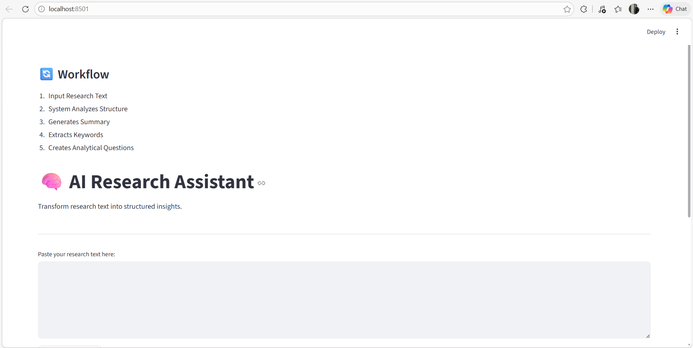
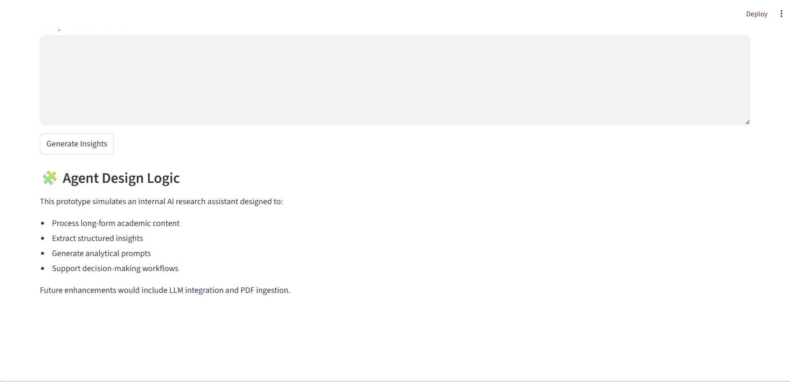
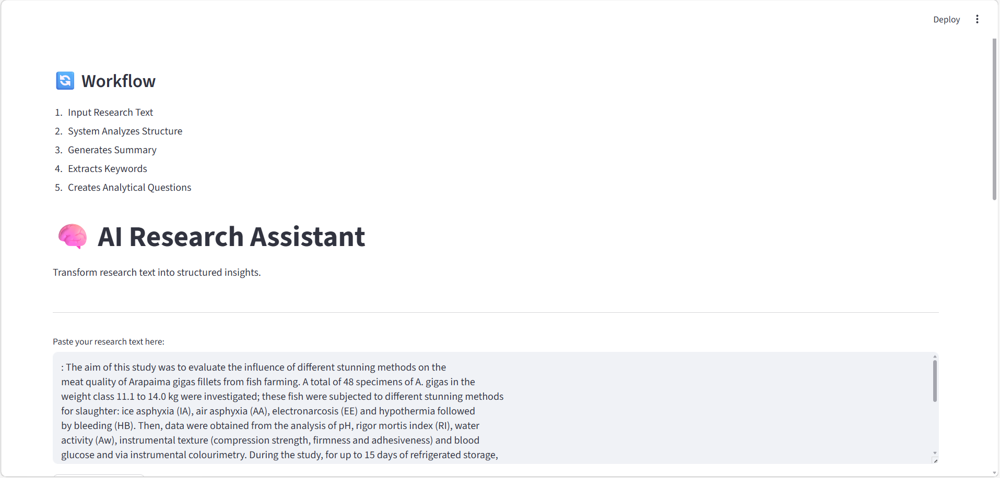
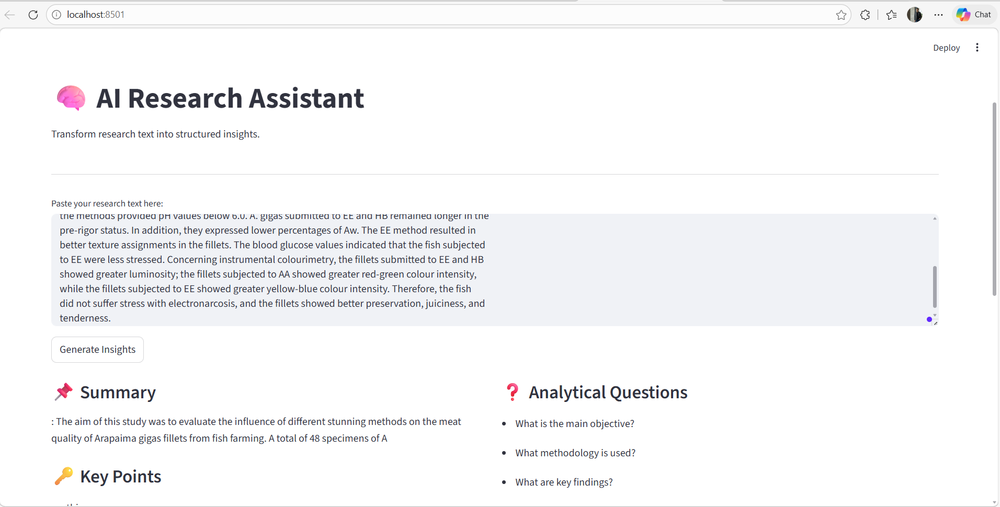

# 🧠 AI Research Assistant

## 📌 Overview
AI Research Assistant is a lightweight analytical tool built using Streamlit.  
It processes academic or long-form text and generates structured insights including summaries, key points, and analytical questions.

This project demonstrates modular Python design and practical application development.

---

## 📷 Demo

## 📷 Home Interface Preview

 


## 📷 Output Interface Preview

 



## 🚀 Features
- 📄 Text Summarization
- 🔑 Key Point Extraction
- ❓ Analytical Question Generation
- 🏗 Modular Code Architecture (app.py + utils.py)
- 💻 Interactive Streamlit Interface

---

## 🏗 Project Structure

```
AI-Research-Agent/
│
├── app.py          # Streamlit UI
├── utils.py        # Processing logic
├── requirements.txt
├── README.md
└── .gitignore
```

---

## 🛠 Tech Stack
- Python
- Streamlit
- Git & GitHub

---

## ⚙ Installation & Run Locally

```bash
git clone https://github.com/Falguni-Adhikary/AI-Research-Agent.git
cd AI-Research-Agent
pip install -r requirements.txt
streamlit run app.py
```


---

## 💼 Why This Project Matters

This project demonstrates:
- Modular Python design
- Streamlit application development
- Text processing logic
- Version control using Git & GitHub
---

## 🔮 Future Enhancements
- LLM Integration
- PDF Upload Support
- Semantic Search
- Research Quality Scoring System


